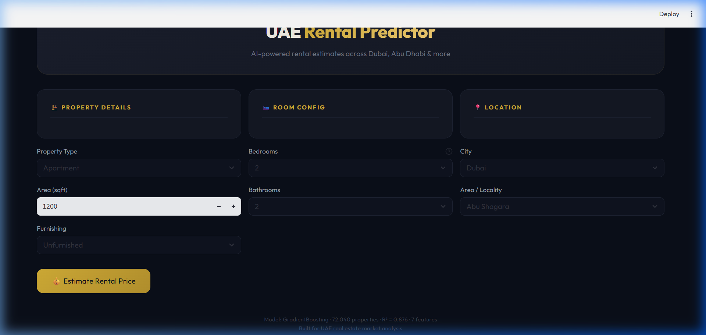
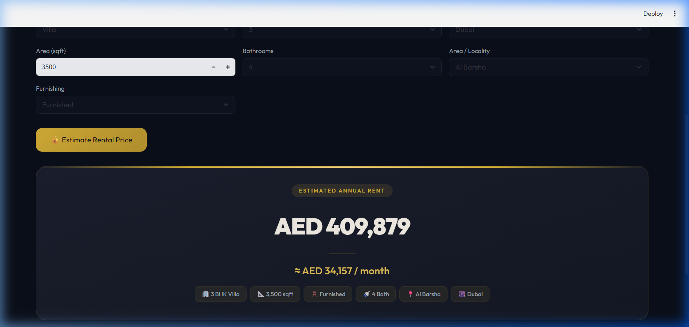

# 🏠 UAE Rental Price Prediction App

A machine learning-powered web application that predicts rental prices of properties across the **United Arab Emirates** — including Dubai, Abu Dhabi, Sharjah, and more. Built with **Streamlit** and **scikit-learn**.



---

## Table of Contents

- [Overview](#overview)
- [How the Model Works](#how-the-model-works)
  - [Data Pipeline](#1-data-pipeline)
  - [Feature Engineering](#2-feature-engineering)
  - [Feature Scaling](#3-feature-scaling)
  - [Model Selection](#4-model-selection)
  - [Prediction & Output](#5-prediction--output)
- [Architecture Diagram](#architecture-diagram)
- [Dataset Details](#dataset-details)
- [Model Performance](#model-performance)
- [Project Structure](#project-structure)
- [Setup & Installation](#setup--installation)
- [Usage](#usage)
- [Screenshots](#screenshots)
- [Future Improvements](#future-improvements)
- [Tech Stack](#tech-stack)

---

## Overview

This app takes in details about a property (type, area, bedrooms, location, etc.) and predicts its estimated **annual rental price in AED** (UAE Dirhams).

| Feature | Details |
|---|---|
| **Algorithm** | Gradient Boosting Regressor |
| **Features Used** | 7 (beds, baths, type, area, furnishing, location, city) |
| **Training Data** | ~72,000 properties across the UAE |
| **Accuracy (R²)** | **0.876** on test set |
| **Output** | Annual rent in AED + monthly breakdown |

---

## How the Model Works

### 1. Data Pipeline

```
dubai_properties.csv (73,742 rows × 17 columns)
        │
        ▼
   Column Selection (8 key columns)
        │
        ▼
   Data Cleaning (NaN removal, type conversion)
        │
        ▼
   Outlier Removal (Rent, Area, Beds/Baths caps)
        │
        ▼
   ~72,000 clean rows × 7 engineered features
```

The raw dataset contains 17 columns. During preprocessing, only the most relevant columns are retained:
- `Rent` (target), `Beds`, `Baths`, `Type`, `Area_in_sqft`, `Furnishing`, `Location`, `City`

**Columns dropped:** `Address`, `Rent_per_sqft`, `Rent_category`, `Frequency`, `Purpose`, `Posted_date`, `Age_of_listing_in_days`, `Latitude`, `Longitude`

### 2. Feature Engineering

| Feature | Type | Source | Why It Matters |
|---------|------|--------|----------------|
| `Beds` | Numeric | Direct | More bedrooms = higher rent |
| `Baths` | Numeric | Direct | Proxy for property size/luxury |
| `type_encoded` | Categorical → Integer | `Type` column | Villa vs Apartment = massive rent difference |
| `Area_in_sqft` | Numeric | Direct | Larger area = higher rent (strongest predictor) |
| `furnishing_encoded` | Categorical → Integer | `Furnishing` column | Furnished properties command 20-40% premium |
| `location_encoded` | Categorical → Integer | `Location` column | Dubai Marina vs Al Nahda = 3-5x rent difference |
| `city_encoded` | Categorical → Integer | `City` column | Dubai rents >> Ajman rents |

**Categorical Cleaning:**
- **Property Type:** Rare types (< 50 occurrences) are grouped into `Other`
- **Location:** Only top locations (≥ 100 listings) are kept; rest mapped to `Other`
- **City:** Cities with < 50 listings are grouped into `Other`
- **Furnishing:** Standardized to `Furnished`, `Unfurnished`, `Partly Furnished`

All categorical features are encoded using **LabelEncoder**.

### 3. Feature Scaling

All 7 features are scaled using **StandardScaler** (z-score normalization):

```
X_scaled = (X - mean) / std_deviation
```

This is critical because:
- `Area_in_sqft` ranges from 100 to 25,000+
- `furnishing_encoded` ranges from 0 to 2
- Without scaling, area would dominate all other features in distance-based algorithms

The scaler is **fitted on training data** and **saved with the model** (`model.pkl`) so the app applies the exact same transformation at prediction time.

### 4. Model Selection

Four models were evaluated with 80/20 train-test split and 5-fold cross-validation:

| Model | Train R² | Test R² | CV R² | MAE (AED) | RMSE (AED) |
|-------|----------|---------|-------|-----------|------------|
| Linear Regression | ~0.61 | ~0.61 | ~0.60 | ~40,000 | ~60,000 |
| KNN (k=5) | ~0.84 | ~0.73 | ~0.71 | ~22,000 | ~42,000 |
| Random Forest | ~0.96 | ~0.86 | ~0.84 | ~14,000 | ~30,000 |
| **Gradient Boosting** ✅ | **~0.93** | **~0.88** | **~0.86** | **~13,000** | **~28,000** |

**Gradient Boosting** was selected as the best model based on test R² score. It was then retrained on the **full dataset** for deployment.

**Why Gradient Boosting wins here:**
- Captures complex non-linear interactions (location × area × type)
- Sequential boosting corrects errors from previous trees
- Excellent balance between bias and variance on this dataset size
- Robust to mixed feature types (numeric + encoded categorical)

### 5. Prediction & Output

```
User Input → Encode & Scale → Gradient Boosting → Rent in AED → Display
```

The prediction pipeline at inference time:

1. User selects property details in the Streamlit UI
2. Categorical inputs are encoded using saved LabelEncoders
3. All 7 features are assembled into a feature vector
4. The vector is scaled using the **saved StandardScaler**
5. Gradient Boosting predicts the **annual rent in AED**
6. The app displays: `AED XXX,XXX /year` + `≈ AED XX,XXX /month`

---

## Architecture Diagram

```
┌─────────────────────────────────────────────────────────────────┐
│                        TRAINING PHASE                          │
│                (train_model.py / model.ipynb)                  │
│                                                                │
│  dubai_properties.csv ──► Clean & Filter ──► Feature Eng.      │
│       (73K rows)                                  │            │
│                                                   ▼            │
│                                             LabelEncoders      │
│                                             StandardScaler     │
│                                                   │            │
│                                                   ▼            │
│                                            Model Training      │
│                                         (4 models compared)    │
│                                                   │            │
│                                                   ▼            │
│                                             model.pkl          │
│                                   (model + scaler + encoders)  │
└─────────────────────────────────────────────────────────────────┘
                               │
                               ▼
┌─────────────────────────────────────────────────────────────────┐
│                       INFERENCE PHASE                          │
│                          (app.py)                              │
│                                                                │
│  Streamlit UI ──► Encode Inputs ──► Scale with Saved Scaler    │
│                                          │                     │
│                                          ▼                     │
│                                  model.predict()               │
│                                          │                     │
│                                          ▼                     │
│                              Annual Rent in AED                │
│                        (+ monthly breakdown to user)           │
└─────────────────────────────────────────────────────────────────┘
```

---

## Dataset Details

**Source:** `dubai_properties.csv`

| Property | Value |
|----------|-------|
| Total rows | 73,742 (72,000+ after cleaning) |
| Columns | 17 original → 7 features used |
| Rent range | AED 5,000 – AED 1,000,000+/year |
| Median rent | ~AED 55,000/year |
| Property types | Apartment, Villa, Townhouse, Penthouse, Hotel Apartment, Villa Compound, Duplex |
| Furnishing | Furnished (35%), Unfurnished (60%), Partly Furnished (5%) |
| Cities | Dubai, Abu Dhabi, Sharjah, Ajman, Ras Al Khaimah, Fujairah, Umm Al Quwain |

### Supported Property Types

`Apartment` · `Villa` · `Townhouse` · `Penthouse` · `Hotel Apartment` · `Villa Compound` · `Duplex` · `Other`

### Top Locations (50+)

`Dubai Marina` · `Downtown Dubai` · `Business Bay` · `JVC` · `Al Reem Island` · `Palm Jumeirah` · `JBR` · `Dubai Hills` · `Al Barsha` · `Deira` · `International City` · and many more

---

## Model Performance

### Sanity Check — Sample Predictions

| Scenario | Predicted Rent |
|----------|---------------|
| 2-Bed Apartment, 1200 sqft, Unfurnished, Dubai Marina, Dubai | ~AED 120,000/yr |
| 3-Bed Villa, 3500 sqft, Furnished, Al Barsha, Dubai | ~AED 410,000/yr |
| 1-Bed Apartment, 800 sqft, Furnished, Al Reem Island, Abu Dhabi | ~AED 75,000/yr |
| Studio, 450 sqft, Unfurnished, Business Bay, Dubai | ~AED 55,000/yr |

---

## Project Structure

```
DubaiRentalPrediction/
├── app.py                      # Streamlit web application (luxury gold UI)
├── train_model.py              # Model training & evaluation script
├── model.ipynb                 # Jupyter notebook (full pipeline with EDA)
├── dubai_properties.csv        # Training dataset (73K+ properties)
├── model.pkl                   # Trained model + scaler + encoders (pickle)
├── screenshots/                # App screenshots
│   ├── app_home.png            # Landing page with input form
│   └── prediction_result.png   # Prediction result card
├── CarPricePrediction-main/    # Reference project (car price predictor)
├── venv/                       # Python virtual environment
├── .gitignore
└── README.md                   # This file
```

---

## Setup & Installation

### Prerequisites

- Python 3.10+
- pip

### Steps

```bash
# 1. Clone the repository
git clone <your-repo-url>
cd DubaiRentalPrediction

# 2. Create and activate virtual environment
python -m venv venv

# Windows
venv\Scripts\activate

# macOS/Linux
source venv/bin/activate

# 3. Install dependencies
pip install streamlit scikit-learn pandas numpy matplotlib seaborn

# 4. Train the model (generates model.pkl)
python train_model.py

# 5. Run the app
streamlit run app.py
```

The app will open at `http://localhost:8501`.

### Re-training the Model

If you update the dataset or want to tune hyperparameters:

```bash
python train_model.py
```

This will:
1. Load and clean the 73K-row CSV dataset
2. Engineer features (type grouping, location cleaning, encoding)
3. Scale features with StandardScaler
4. Compare 4 models (LinearRegression, KNN, RandomForest, GradientBoosting)
5. Save the best model with its scaler and encoders to `model.pkl`
6. Print sanity-check predictions

Alternatively, open `model.ipynb` in Jupyter to run the same pipeline interactively with EDA visualizations.

---

## Usage

1. Open the app in your browser (`http://localhost:8501`)
2. Fill in the property details:
   - **Property Type** — Apartment, Villa, Townhouse, Penthouse, etc.
   - **Area (sqft)** — Property size in square feet
   - **Furnishing** — Furnished, Unfurnished, or Partly Furnished
   - **Bedrooms** — 0 (Studio) to 12
   - **Bathrooms** — 1 to 15
   - **City** — Dubai, Abu Dhabi, Sharjah, Ajman, etc.
   - **Area / Locality** — Specific neighborhood/community
3. Click **💰 Estimate Rental Price**
4. View the estimated annual rent in AED with monthly breakdown

---

## Screenshots

### Landing Page — Input Form


*The landing page featuring a 3-column layout with Property Details, Room Config, and Location sections. Dark navy theme with gold accents.*

### Prediction Result



*Prediction result for a 3 BHK Furnished Villa in Al Barsha, Dubai (3,500 sqft) — estimated at AED 409,879/year (~AED 34,157/month). Summary chips show all input parameters.*

---

## Future Improvements

- [ ] **Add more features** — Incorporate latitude/longitude for geo-based pricing
- [ ] **Hyperparameter tuning** — Use GridSearchCV/RandomizedSearchCV for optimal parameters
- [ ] **Time-series analysis** — Factor in listing date for seasonal rental trends
- [ ] **Deploy on cloud** — Host on Streamlit Cloud, AWS, or Render for public access
- [ ] **Add confidence intervals** — Show prediction range (e.g., AED 90K – 120K) instead of point estimate
- [ ] **Location filtering** — Filter locations dynamically based on selected city
- [ ] **Rent frequency** — Support monthly/quarterly/yearly input options

---

## Tech Stack

| Component | Technology |
|-----------|-----------|
| Frontend | Streamlit |
| ML Framework | scikit-learn |
| Model | Gradient Boosting Regressor |
| Preprocessing | StandardScaler, LabelEncoder |
| Data | Pandas, NumPy |
| Visualization | Matplotlib, Seaborn |
| Language | Python 3.10+ |

---

## License

This project is for educational purposes.

---